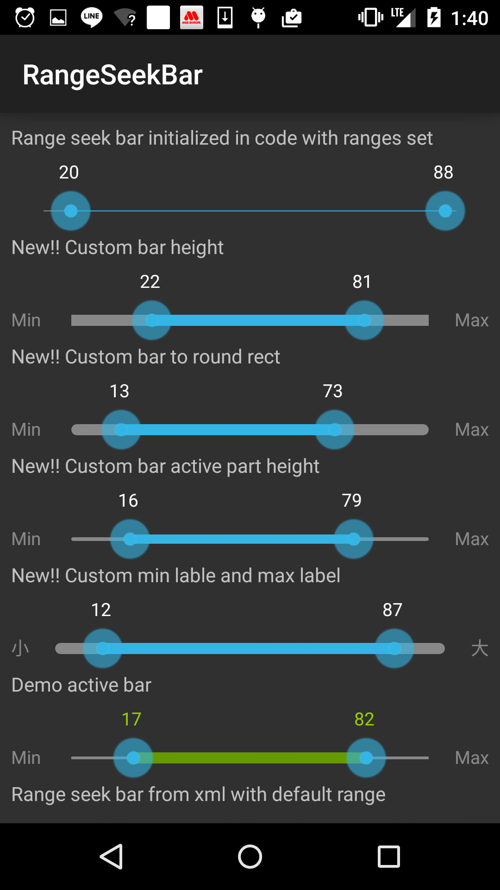

range-seek-bar
======================

# Introduction

If you are coming from [the original repo](https://github.com/yahoo/android-range-seek-bar), it has a [new home](https://github.com/anothem/android-range-seek-bar) so if you're seeing this, you're probably in the right place.

This library provides a SeekBar similar to the default Android one, but with two thumb controls allowing a range to be selected.




# Features and customizations

Main features:

* Two thumbs allowing a range to be selected
* Supports integer ranges and floating point ranges
* Text indicating the selected min and max values on the bar
* Smoother drag animation

Customizations:

* Ability to initialise from XML, with attributes (only tested for Integer and Double, would not support all the original types that the class supports when initialized programmatically)
* Ability to make the range-seek-bar only use one thumb instead of two, with all other feature remaining; can be set from XML.
  This makes it more similar to the default android seekbar, but you still benefit from the other features and very smooth animation.
* Text above thumbs can be disabled and colour can be changed
* Custom icons can be used for the thumbs
* Custom bar height, bar active height and round rect bar
* Custom min and max string

# How to run demo

Should be able to import, build and run in Android Studio or from the command line with gradle.
The rangeseekbar-sample shows the available features and customizations in code and XML.

# How to use in your own project

## Setup as Gradle dependency

* Add this in your build.gradle file:

 * For latest release: 

```groovy
	dependencies {
    	compile 'org.florescu.android.rangeseekbar:rangeseekbar-library:0.2.0'
	}
```

 * For the latest work-in-progress snapshot:

```groovy
	dependencies {
    	compile 'org.florescu.android.rangeseekbar:rangeseekbar-library:0.3.0-SNAPSHOT'
	}
```

# Credits

The android-range-seek-bar started as a fork of the following project: https://code.google.com/p/range-seek-bar/ under Apache license.

# License

The images are licensed under Creative Commons ( http://creativecommons.org/licenses/by/3.0/ ). The originals are provided in the original project ( https://code.google.com/p/range-seek-bar/ ) and seek_thumb_disabled.png is added by us.

The source code is licensed under the Apache License. A copy of this can be found at http://www.apache.org/licenses/LICENSE-2.0 and has been included in the repository as well.
